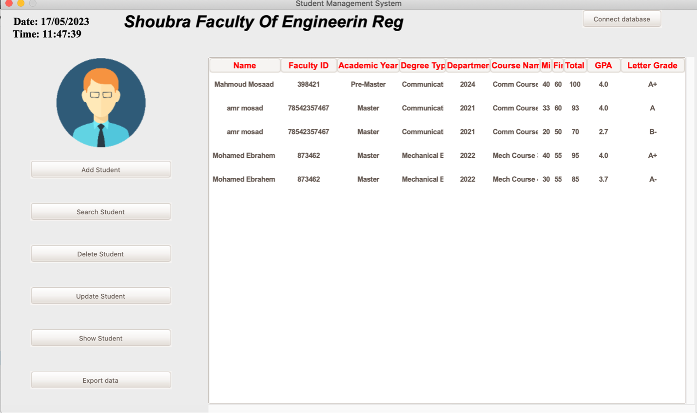

# Student Management System

This project is an implementation of a **Student Management System** using the **Tkinter** library in Python. The system allows you to manage student information, including:
- Adding students
- Searching for students
- Updating student records
- Deleting students
- Displaying student details
- Exporting data to a CSV file
## Demo of project 

## 🖥️ Overview

This system provides a **GUI-based login page** where users can authenticate before accessing the student database.

### 🔹 Login Page
The login page consists of:
- A **background image**
- A **login frame** containing the username & password fields
- A **login button** to authenticate users

📌 **Example Login Page:**


Upon successful login, the **main student management system** launches.

---
## 🛠 Installation & Setup

To run this project, ensure you have the required dependencies installed:
```sh
pip install pillow pandas psycopg2
```

### 📂 File Structure
```
├── images/
│   ├── bg.jpg          # Background image
│   ├── logo.png        # Logo image
│   ├── user.png        # Username icon
│   ├── password.png    # Password icon
├── main.py             # Login script
├── sms.py              # Student Management System main script
├── README.md           # Documentation
```

---
## 🚀 Functionality

### ✅ Database Connection
The `connect_database()` function allows users to connect to a **PostgreSQL database**.

### ✅ Student Operations
| Feature | Description |
|---------|------------|
| **Add Student** | Users can add student details like name, faculty ID, academic year, and courses. |
| **Search Student** | Find students using their **Faculty ID**. |
| **Update Student** | Modify student details (currently needs implementation). |
| **Delete Student** | Remove a student from the database. |
| **Show All Students** | Display all students in a tabular format. |
| **Export Data** | Save student records as a CSV file. |

📌 **Example Student Dashboard:**


---
## 🖥️ GUI Layout
The **GUI layout** consists of two sections:
1. **Left Frame** → Contains buttons for different operations
2. **Right Frame** → Displays student details in a **Treeview Table**

### 🎨 Additional Features
- **Animated Header**: Displays "Shoubra Faculty Of Engineering Registration System".
- **Live Clock**: Shows the current date and time.

---
## 📌 Usage Example
```sh
python main.py
```
1. **Login** using the credentials (default: username - "mahmoud", password - "1234").
2. **Manage students** using the available options.
3. **Export student data** as needed.

---
## 📦 Dependencies
- `tkinter` - GUI framework
- `pandas` - Data manipulation
- `psycopg2` - PostgreSQL connection
- `Pillow (PIL)` - Image processing

---
## 🔗 Acknowledgments
- **Tkinter & PIL** for GUI development.
- **PostgreSQL** for database management.

Feel free to contribute and improve this project! 🚀
